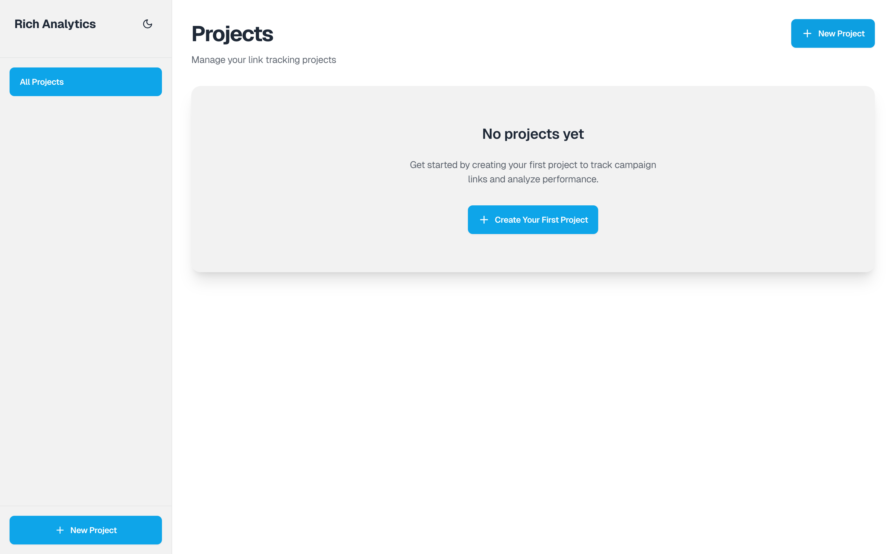
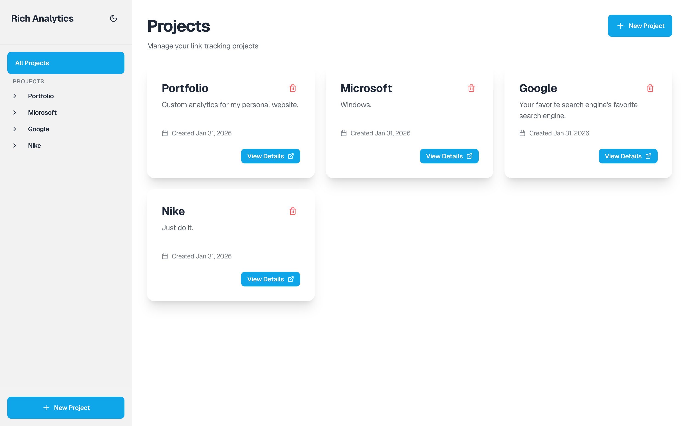
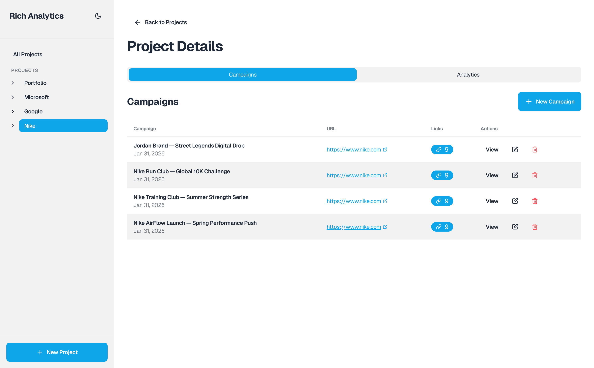
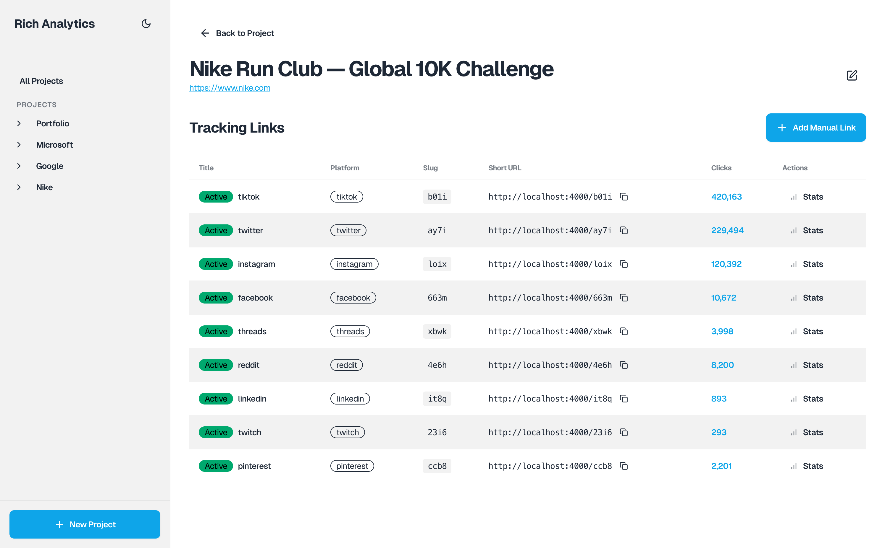
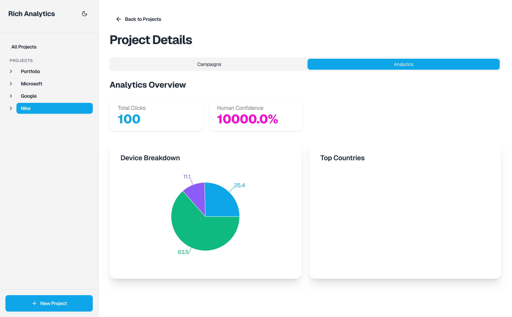

**RAT (Rich Analytics Tool)** is a self hosted link tracking and campaign analytics system originally built to support freelance client work, by tracking how audiences engage with distributed content across platforms. It helps creators and brands understand where their audiences are most active, how their content is being engaged with, and which platforms drive the highest impact. The insights generated can be shared with sponsors, partners, and evaluators as tangible performance data.

This open sourced version is a generalized implementation of the system, designed so developers can extend it and build analytics that matter most to their own clients. You’re encouraged to fork it and build custom analytics pipelines that align with your own needs.


## Features

- **Project Management**: Organize campaigns by client/project
- **Link Tracking**: Generate and track custom short links
- **Analytics Dashboard**: Visualize clicks, devices, geography, and more
- **Modern UI**: Built with TailwindCSS + DaisyUI
- **Dark Mode**: Toggle between light and dark themes
- **Behavioral Insights**: Detect human vs bot traffic, engagement velocity, and campaign performance signals
- **RAT can log**:
	- IP address (for geo lookup)
	- Device type & browser (via user-agent parsing)
	- Referrer
	- Timestamp
	- Campaign + link identifiers

## How to Use

1. Create a Project for your client or initiative.

2. Create a Campaign within that project to represent a specific promotion, launch, or content push.

3. When a campaign is created, the system automatically generates nine platform-specific tracking links for distribution across social channels and marketing surfaces.

4. Share these links in your content to begin collecting engagement and performance data.

## Tech Stack

- **Framework**: Next.js 14 (App Router)
- **UI**: TailwindCSS + DaisyUI
- **State Management**: Zustand
- **Charts**: Recharts
- **Icons**: lucide-react
- **HTTP Client**: axios
- **Language**: TypeScript
- **Database**: MongoDB
- **Backend Tech**: Nodejs/Express

##  Quickstart

### Step 1: Install Dependencies (client & server)

```bash
git clone https://github.com/jordansmalls/rat
cd rat

cd client && pnpm install
cd ..

cd server && pnpm install
```

### Step 2: Configure API

Create `.env.local` file:

```bash
NEXT_PUBLIC_API_BASE=http://localhost:4000
```

If you change the port you are serving your backend, or choose to host it elsewhere, update the frontend's API base URL with your actual API endpoint.

### Step 3: Run Development Server (client & server)

```bash
# in one terminal window
cd client && pnpm run dev

# in another terminal window
cd server && pnpm run dev
```

Visit `http://localhost:3000` to utilize the application. Start by creating your first project and first campaign.

## Screenshots

Fresh Dashboard View



Example Dashboard View



Project Details Page



Campaign Details Page



Project Analytics Page




## Client Filetree

The frontend is a Next.js App Router project that communicates with a REST API server. State is centralized with Zustand and all network calls flow through a typed API layer.

```
RAT/
│
├── app/                                    # Next.js App Router (NO src/ directory)
│   ├── layout.tsx                          # Root layout with Sidebar
│   ├── page.tsx                            # Homepage - Projects list
│   ├── globals.css                         # Global styles (Tailwind directives)
│   │
│   └── projects/
│       ├── new/
│       │   └── page.tsx                    # Create new project form
│       │
│       └── [projectId]/                    # Dynamic route for project ID
│           ├── page.tsx                    # Project detail (tabs: campaigns/analytics)
│           │
│           └── campaigns/
│               ├── new/
│               │   └── page.tsx            # Create new campaign form
│               │
│               └── [campaignId]/           # Dynamic route for campaign ID
│                   ├── page.tsx            # Campaign detail with links table
│                   │
│                   └── links/
│                       ├── new/
│                       │   └── page.tsx    # Add manual link form
│                       │
│                       └── [slug]/         # Dynamic route for link slug
│                           └── page.tsx    # Link analytics dashboard
│
├── components/                             # Reusable React components
│   ├── Sidebar.tsx                         # Navigation sidebar with theme toggle
│   ├── ProjectCard.tsx                     # Project card for grid display
│   ├── CampaignCard.tsx                    # Campaign table row component
│   └── LinkRow.tsx                         # Link table row component
│
├── stores/                                 # Zustand state management
│   └── useProjectStore.ts                  # Global store for projects/campaigns/links
│
├── lib/                                    # Utility functions and types
│   ├── api.ts                              # Axios API client (all endpoints)
│   └── types.ts                            # TypeScript interfaces
│
├── public/                                 # Static assets (empty by default)
│
├── .env.example                            # Environment variables template
├── .eslintrc.json                          # ESLint configuration
├── .gitignore                              # Git ignore rules
├── next.config.js                          # Next.js configuration
├── package.json                            # Dependencies and scripts
├── postcss.config.js                       # PostCSS configuration
├── tailwind.config.ts                      # Tailwind + DaisyUI configuration
├── tsconfig.json                           # TypeScript configuration
```

##  Key Pages

- `/` - Projects list
- `/projects/new` - Create project
- `/projects/[id]` - Project detail (campaigns + analytics tabs)
- `/projects/[id]/campaigns/new` - Create campaign
- `/projects/[id]/campaigns/[id]` - Campaign links
- `/projects/[id]/campaigns/[id]/links/new` - Add manual link
- `/projects/[id]/campaigns/[id]/links/[slug]` - Link analytics

## Notes

- This project ships without authentication and is intended for local or private use. If deploying publicly, you should implement authentication, rate limiting, and abuse protection.
- All API calls go through `lib/api.ts`
- State managed by `stores/useProjectStore.ts`
- Theme toggles in sidebar (persists to localStorage)

##  Client Troubleshooting

- **API Errors**: Ensure server is running and `NEXT_PUBLIC_API_BASE` is correct.
- **Build Errors**: Run `pnpm install` again
- **Missing Data**: Check browser console for API response errors


## Server Endpoints

Here are the endpoints for the RESTful backend API.

### Projects Endpoints

```javascript
// @desc    create new project
// @route   POST /api/projects

// @desc    fetch all projects
// @route   GET /api/projects

// @desc    fetch all campaigns for a project
// @route   GET /api/projects/:project_id/campaigns

// @desc     fetch project details
// @route    GET /api/projects/:project_id

// @desc     update project details
// @route    PUT /api/projects/:project_id

// @desc    delete existing project
// @route   DELETE /api/projects/:project_id
```


### Campaign Endpoints

```javascript
// @desc    fetch all campaigns
// @route   GET /api/campaigns

// @desc    fetch all links for a campaign
// @route   GET /api/campaigns/:campaign_id/links

// @desc    create new campaign
// @route   POST /api/campaigns

// @desc    manually create new link
// @route   POST /api/campaigns/manual

// @desc    fetch campaign details
// @route   GET /api/campaigns/:campaign_id

// @desc    update campaign details
// @route   PUT /api/campaigns/:campaign_id

// @desc    delete campaign
// @route   DELETE /api/campaigns/:campaign_id
```

### Redirect Endpoint

```javascript
//  @desc    handle short link redirect + analytics tracking
//  @route   GET /:slug
```

### Analytics Endpoints

These endpoints compute higher level engagement metrics derived from clickstream data, device fingerprints, and temporal patterns.

```javascript
// @desc    Get human confidence percentage
// @route   GET /api/analytics/project/:projectId/human-confidence

// @desc    Download clicks as JSON or CSV
// @route   GET /api/analytics/project/:projectId/export

// @desc    Get clicks per platform
// @route   GET /api/analytics/project/:projectId/clicks-per-platform

// @desc    Get global reach by country
// @route   GET /api/analytics/project/:projectId/global-reach

// @desc    Get platform efficiency (intent ratio)
// @route   GET /api/analytics/project/:projectId/efficiency

// @desc    Get golden hour heatmap
// @route   GET /api/analytics/project/:projectId/heatmap

// @desc    Get loyalty metrics
// @route   GET /api/analytics/project/:projectId/loyalty

// @desc    Get device breakdown
// @route   GET /api/analytics/project/:projectId/device-breakdown

// @desc    Get recent activity
// @route   GET /api/analytics/project/:projectId/recent-activity

// @desc    Get platform dominance
// @route   GET /api/analytics/project/:projectId/platform-dominance

// @desc    Get network effect
// @route   GET /api/analytics/project/:projectId/network-effect

// @desc    Get velocity (growth rate)
// @route   GET /api/analytics/project/:projectId/velocity

// @desc    Get hero campaign
// @route   GET /api/analytics/project/:projectId/hero-campaign

// @desc    Get monthly health
// @route   GET /api/analytics/project/:projectId/monthly-health
```

## Authentication & Security

RAT is shared as a foundational analytics framework and does **not** include authentication or access control out of the box. It was originally designed for private, controlled environments.

If you plan to deploy this application beyond local or internal use, you should implement proper security measures, including:

- User authentication and authorization

- Rate limiting and abuse prevention on public endpoints

- HTTPS with secure proxy/header configuration

- Input validation and request sanitization

- Protection against automated/bot traffic manipulation

Because the platform collects engagement and device data, you are responsible for ensuring your deployment complies with applicable privacy and data protection regulations in your region.

This project is intended to be extended—security should be treated as a required part of any production deployment.


## Improvements and Fixes

- Updates to CSV formatting (currently broken)
- Update to data for countries chart in analytics campaign page